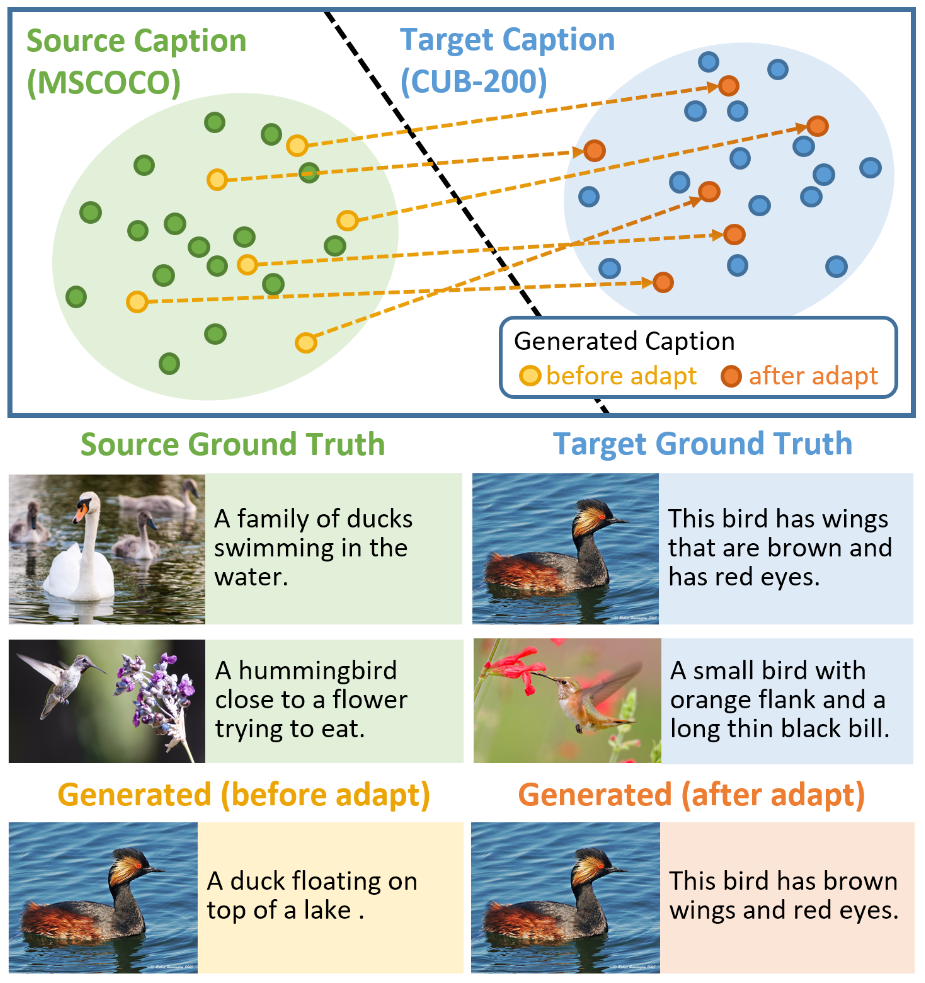
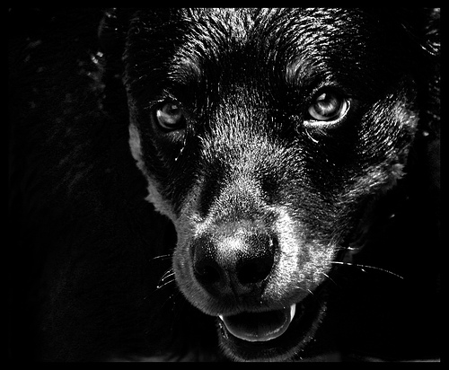

# show-adapt-and-tell

This is the official code for the paper

**[Show, Adapt and Tell: Adversarial Training of Cross-domain Image Captioner](https://arxiv.org/pdf/1705.00930.pdf)**
<br>
[Tseng-Hung Chen](https://tsenghungchen.github.io/),
[Yuan-Hong Liao](https://andrewliao11.github.io/),
[Ching-Yao Chuang](http://jameschuanggg.github.io/),
[Wan-Ting Hsu](https://hsuwanting.github.io/),
[Jianlong Fu](https://www.microsoft.com/en-us/research/people/jianf/),
[Min Sun](http://aliensunmin.github.io/)
<br>
Presented at [ICCV 2017](http://iccv2017.thecvf.com/)


<div align='center'>
  
</div>

In this repository we provide:

- The cross-domain captioning models [used in the paper](#models-from-the-paper)
- Script for [preprocessing MSCOCO data](#mscoco-captioning-dataset)
- Script for [preprocessing CUB-200-2011 captions](#cub-200-2011-with-descriptions)
- Code for [training the cross-domain captioning models](#training)


If you find this code useful for your research, please cite

```
@article{chen2017show,
  title={Show, Adapt and Tell: Adversarial Training of Cross-domain Image Captioner},
  author={Chen, Tseng-Hung and Liao, Yuan-Hong and Chuang, Ching-Yao and Hsu, Wan-Ting and Fu, Jianlong and Sun, Min},
  journal={arXiv preprint arXiv:1705.00930},
  year={2017}
}
```

## Requirements

- Python 2.7
- [Tensoflow 0.12.1](https://www.tensorflow.org/versions/r0.12/get_started/os_setup)
- [Caffe](https://github.com/BVLC/caffe)
- OpenCV 2.4.9

## Data Preprocessing

### MSCOCO Captioning dataset

#### Feature Extraction
1. Download the pretrained [ResNet-101 model](https://onedrive.live.com/?authkey=%21AAFW2-FVoxeVRck&id=4006CBB8476FF777%2117887&cid=4006CBB8476FF777) and place it under `data-prepro/MSCOCO_preprocess/resnet_model/`.
2. Please modify the caffe path in `data-prepro/MSCOCO_preprocess/extract_resnet_coco.py`.
2. Go to `data-prepro/MSCOCO_preprocess` and run the following script:
`./download_mscoco.sh` for downloading images and extracting features.

#### Captions Tokenization
1. Clone the [NeuralTalk2](https://github.com/karpathy/neuraltalk2/tree/bd8c9d879f957e1218a8f9e1f9b663ac70375866) repository and head over to the coco/ folder and run the IPython notebook to generate a json file for Karpathy split: `coco_raw.json`.
2. Run the following script:
`./prepro_mscoco_caption.sh` for downloading and tokenizing captions.
3. Run `python prepro_coco_annotation.py` to generate annotation json file for testing. 

### CUB-200-2011 with Descriptions
#### Feature Extraction
1. Run the script `./download_cub.sh` to download the images in CUB-200-2011.
2. Please modify the input/output path in `data-prepro/MSCOCO_preprocess/extract_resnet_coco.py` to extract and pack features in CUB-200-2011.

#### Captions Tokenization
1. Download the [description data](https://drive.google.com/open?id=0B0ywwgffWnLLZW9uVHNjb2JmNlE).
2. Run `python get_split.py` to generate dataset split following the ECCV16 paper "Generating Visual Explanations".
3. Run `python prepro_cub_annotation.py` to generate annotation json file for testing. 
4. Run `python CUB_preprocess_token.py` for tokenization.


## Models from the paper

### Pretrained Models
Download all pretrained and adaption models:

- [MSCOCO pretrained model](https://drive.google.com/drive/folders/0B340bHpZlbZzYW91R0UtNDRXUDA?usp=sharing)
- [CUB-200-2011 adaptation model](https://drive.google.com/drive/folders/0B340bHpZlbZzNUZybXNzWVR2VWM?usp=sharing)
- [TGIF adaptation model](https://drive.google.com/drive/folders/0B340bHpZlbZzX0ZWcFZ1YzdrSTg?usp=sharing)
- [Flickr30k adaptation model](https://drive.google.com/drive/folders/0B340bHpZlbZzNldjRmZVX3JXdVk?usp=sharing)

### Example Results
Here are some example results where the captions are generated from these models:


<table border=1>
<tr>
<td>

	<div align='center'>
	
	</div>
	MSCOCO: A large air plane on a run way.
	</br>
	CUB-200-2011: A large white and black airplane with a large beak.
	</br>
	TGIF: A plane is flying over a field.
	</br>
	Flickr30k: A large airplane is sitting on a runway.	
</td>
<td>

	<div align='center'>
	
	</div>
	MSCOCO: A traffic light is seen in front of a large building.
	</br>
	CUB-200-2011: A yellow traffic light with a yellow light.
	</br>
	TGIF: A traffic light is hanging on a pole.
	</br>
	Flickr30k: A street sign is lit up in the dark.
	
</td>
</tr>
</table>

<table border=1>
<tr>
<td>

	<div align='center'>
	
	</div>
	MSCOCO: A black dog sitting on the ground next to a window.
	</br>
	CUB-200-2011: A black and white dog with a black head.
	</br>
	TGIF: A dog is looking at something in the mirror.
	</br>
	Flickr30k: A black dog is looking out of the window.
</td>
<td>

	<div align='center'>
	
	</div>
	MSCOCO: A man riding a skateboard up the side of a ramp.
	</br>
	CUB-200-2011: A man riding a skateboard on a white ramp.
	</br>
	TGIF: A man is doing a trick on a skateboard.
	</br>
	Flickr30k: A man in a blue shirt is doing a trick on a skateboard.
</td>
</tr>
</table>


## Training
The training codes are under the `show-adapt-tell/` folder.

Simply run `python main.py` for two steps of training:

### Training the source model with paired image-caption data
Please set the Boolean value of `"G_is_pretrain"` to True in `main.py` to start pretraining the generator.
### Training the cross-domain captioner with unpaired data
After pretraining, set `"G_is_pretrain"` to False to start training the cross-domain model.

## License

Free for personal or research use; for commercial use please contact me.

